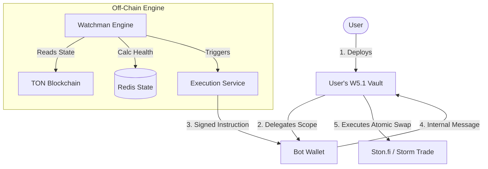

# 🍈 Pamelo.finance: Institutional-Grade Basis Trading for TON

**Whitepaper v3.0 | January 2026**

---

## 1. Executive Summary

The TON ecosystem has successfully onboarded over 900 million users through the Telegram Mini-App (TMA) infrastructure. However, the current retail environment is dominated by high-volatility "meme" assets (e.g., $DOGS, $NOT, $REDO) that often lead to significant capital erosion for non-professional traders.

**Pamelo.finance** serves as an "Institutional Refiner." We bridge the gap between high-risk retail speculation and stable wealth generation. By leveraging **TON W5.1 Account Abstraction** and automated delta-neutral strategies, Pamelo allows users to harvest "Funding Rates" from speculators while maintaining zero exposure to asset price crashes.

---

## 2. The Strategy: Automated Basis Trading

The core of Pamelo is the **Cash & Carry** strategy, a staple of institutional hedge funds, now automated for the average Telegram user.

### 2.1. The Math of Neutrality

We achieve **Delta Neutrality** by balancing a Spot Long position with an equal-value Perpetual Short position.

**Total Equity Equation**:

```math
Equity = Value_spot + Value_short
```

Where:

- `Value_spot`: `Balance_spot × Price_current`
- `Value_short`: `Size_perp × (Entry_Price - Price_current)`

**Perfect Neutrality** implies:

```math
ΔEquity / ΔPrice ≈ 0
```

This means your principal value remains constant regardless of whether the asset price goes up or down.

### 2.2. The Yield Mechanism

The protocol captures the **Funding Rate**—a periodic fee paid between long and short traders. In the exuberant TON meme ecosystem, Longs typically pay Shorts.

**Example: 1,000 TON Investment**

1.  **Atomic Entry**:
    - Swap 500 TON for Spot Asset (e.g., $DOGS).
    - Use 500 TON as Collateral to Open 1x Short on $DOGS.
2.  **State**: Net Exposure = 0.
3.  **Harvest**: Every 8 hours, the Short position receives a Funding Fee (e.g., 0.1%).

---

## 3. Technical Architecture: The "Watchman" System

### 3.1. Isolated W5.1 Vaults (Institutional Security)

Pamelo implements a strict **Isolated Vault Pattern**. Unlike basic bots that request access to your main wallet, Pamelo deploys a **dedicated W5.1 Smart Contract** for every position.



- **Segregated Capital**: A loss in one meme coin vault cannot affect your other positions.
- **Strict Delegation**: The "Keeper" is granted scoped permission via W5.1 Extensions.
- **Owner Control**: You retain full Admin Rights and can revoke the Keeper at any time.

### 3.2. Off-Chain Engine (Next.js + Redis)

A high-availability **Redis** task queue manages the "Keep-Alive" logic:

- **Valuation Job**: Polls Oracle prices every 60s.
- **Drift Monitor**: Checks if `|Spot - Short| / Spot > 1.5%`. Triggers Rebalance.
- **Safety Check**: Validates Equity against Max Loss thresholds.

---

## 4. Safety Architecture & Risk Algorithms

### 4.1. The Max Loss Guardrail (with EMA Smoothing)

To protect against catastrophic failure (de-pegging), users set a **Capital Floor**. We use **EMA Smoothing** to prevent false liquidations from "wick" price crashes.

**Algorithm**:

```math
Price_smoothed = EMA_5(Price_history)
```

If `Equity_real_time < Principal * (1 - Max_Loss_%)`:
-> **TRIGGER PANIC UNWIND**

### 4.2. Slippage Protection & TWAP

Liquidity for meme coins can be thin. Dumping a large position instantly causes slippage losses.

**Logic**:

1.  **Simulate**: Use Ston.fi API to estimate price impact.
2.  **Branch**:
    - **Impact < 5%**: Execute **Atomic Unwind** (Single Transaction).
    - **Impact > 5%**: Execute **Chunked Unwind (TWAP Lite)**.
      - Sell 10% of Spot + Close 10% of Short.
      - Wait 30s.
      - Repeat.

### 4.3. Funding Guard ("Death Spiral" Prevention)

In bear markets, funding can turn negative (Shorts pay Longs).

**Algorithm**:
If `EMA_24h(Funding_Rate) < 0`:
-> **ENTER STASIS MODE**.

- Close Short.
- Swap Spot to **Liquid Staking Token** (e.g., `tsTON`).
- Earn ~4% APY safely until rates recover.

---

## 5. UI/UX Flow: The "Three-Click" Yield

| Step           | UI Action                     | Technical Backend Action                 |
| :------------- | :---------------------------- | :--------------------------------------- |
| **1. Select**  | Choose a Vault (e.g., $REDO). | Fetch Storm Trade funding data.          |
| **2. Deposit** | Input TON & Risk Params.      | Deploy W5 Vault & Delegate to Keeper.    |
| **3. Monitor** | View "Live Audit Ledger".     | Poll Redis for health & rebalances.      |
| **4. Exit**    | Hit **"Panic Button"**.       | Execute Atomic Unwind (with TWAP check). |

---

## 6. Transparency: The Audit Ledger

Every automated move is logged immutably.

| Time (UTC) | Action        | Reason                      | TX Hash    |
| :--------- | :------------ | :-------------------------- | :--------- |
| 10:00:01   | **Check**     | Health: 100.0%              | -          |
| 10:15:22   | **Rebalance** | Delta Drift 1.7%            | `0xABC...` |
| 10:45:00   | **TWAP Step** | Unwind 10% (Slippage Audit) | `0xDEF...` |

---

### **Conclusion**

Pamelo.finance combines institutional financial engineering with the raw energy of the TON ecosystem. By automating **Delta Neutrality**, **Slippage Protection**, and **W5.1 Security**, we provide the safest way to farm yield on Telegram.
