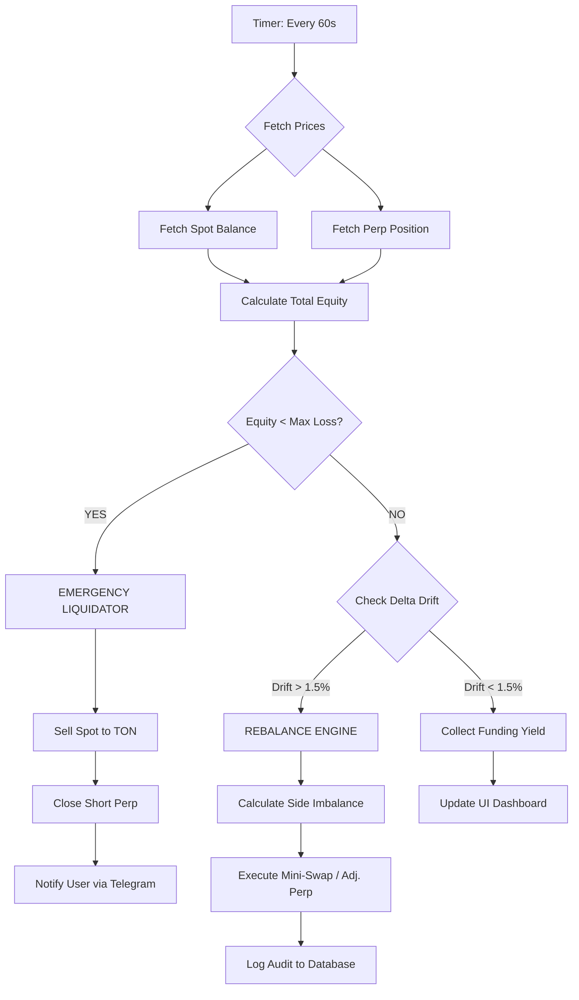

# 🍈 Pamelo.finance: Institutional-Grade Basis Trading for TON

**Whitepaper v2.0 | January 2026**

---

## 1. Executive Summary

The TON ecosystem has successfully onboarded over 900 million users through the Telegram Mini-App (TMA) infrastructure. However, the current retail environment is dominated by high-volatility "meme" assets (e.g., $DOGS, $NOT, $REDO) that often lead to significant capital erosion for non-professional traders.

**Pamelo.finance** serves as an "Institutional Refiner." We bridge the gap between high-risk retail speculation and stable wealth generation. By leveraging **TON W5 Account Abstraction** and automated delta-neutral strategies, Pamelo allows users to harvest "Funding Rates" from speculators while maintaining zero exposure to asset price crashes.

---

## 2. The Strategy: Automated Basis Trading

The core of Pamelo is the **Cash & Carry** strategy, a staple of institutional hedge funds, now automated for the average Telegram user.

### 2.1. The Mechanics

The protocol captures the **Funding Rate**—a periodic fee paid between long and short traders on perpetual futures exchanges to keep the contract price pegged to the spot price. In exuberant bull markets (typical for TON meme coins), long traders pay short traders.

**Example: Investing 1,000 TON into the $DOGS Strategy**

1. **The Atomic Open:**

- **Spot Long:** (495 TON) is swapped for **$DOGS** via **swap.coffee**.
- **Perp Short:** (505 TON) is used as collateral on **Storm Trade** to open a **1x Short** position.

2. **The Delta-Neutral State:**

- If rises by , the Spot leg gains and the Short leg loses .
- If drops by , the Short leg gains and the Spot leg loses .
- The net value (Principal) remains stable regardless of price action.

3. **The Harvest:** While the price moves, the user collects the **Funding Fee** (e.g., every 8 hours).

---

## 3. Technical Architecture: The "Watchman" System

### 3.1. Isolated W5 Vaults (Institutional Security)

Pamelo implements a strict **Isolated Vault Pattern** for maximum security. Unlike basic bots that request access to your main wallet, Pamelo deploys a **dedicated W5 Smart Contract** for every single position you open.

- **Zero Contagion Risk:** Your main personal wallet never connects to the exchange. It simply funds the isolated Vault.
- **Segregated Capital:** Each strategy runs in its own sandbox. A loss in one meme coin vault cannot affect your other positions or your main holdings.
- **Strict Delegation:** The "Keeper" (Automation Bot) is granted permission _only_ on this specific Vault contract, not your main identity.
- **Owner Control:** You retain full ownership (Admin Rights) of the Vault and can withdraw funds or revoke the Keeper at any time via the "Panic Button".

### 3.2. Redis-Backed Automation Engine

A high-availability **Redis** task queue within the **Next.js** infrastructure acts as the protocol's decentralized "keep-alive" bot.

- **Drift Management:** If , the **Redis-backed worker** triggers a **Rebalance** to buy or sell small amounts of the spot asset, ensuring the hedge remains 1:1.
- **Deleverage Protection:** If the collateral ratio on Storm Trade falls below , the worker automatically shifts funds from Spot to Perp Collateral.

---

## 4. Safety Architecture & Risk Mitigation

### 4.1. The Max Loss Guardrail

To protect against extreme slippage or "Basis Drift," users set a **Capital Floor** at the start of every session.

**The Calculation:**
Every 60 seconds, the **Background Worker** calculates the **Total Equity ():**

If , the **Emergency Liquidator** is engaged:

1.  **Market Sell** all Spot assets on **swap.coffee**.
2.  **Close Short** on **Storm Trade** and withdraw collateral.
3.  **Return** all TON to the user's wallet instantly.

### 4.2. Negative Funding & "Stasis Mode"

In rare bear markets, shorts may have to pay longs.

- **Solution:** If the 24h moving average of the funding rate turns negative, the system enters **Stasis Mode**. It closes positions and moves funds into liquid staking (e.g., **stTON**) to earn a safe yield until positive funding returns.

---

## 5. UI/UX Flow: The "Three-Click" Yield

| Step           | UI Action                                | Technical Backend Action                        |
| -------------- | ---------------------------------------- | ----------------------------------------------- |
| **1. Select**  | Choose a "Hot" Meme Vault (e.g., $REDO). | Fetch real-time funding rates from Storm Trade. |
| **2. Deposit** | Input TON and set **Max Loss %**.        | Deploy W5 Account and sign **Session Key**.     |
| **3. Refine**  | Click **"Start Refining"**.              | Execute Atomic Open (Swap + Perp Short).        |
| **4. Monitor** | View "Live Audit Ledger".                | Backend polls prices and logs every rebalance.  |
| **5. Exit**    | Hit **"Panic Button"**.                  | Execute Emergency Unwind and terminate Session. |

---

## 6. Visual Logic & Workflow

Below is the logic governing the **Pamelo Watchman** via Next.js + Redis:

---

## 7. Tokenomics & Business Model

Pamelo aligns its success entirely with the user.

- **Entry/Exit Fees:**
- **Management Fees:**
- **Success Fee:** ** of Net Yield**.
- **User Share:** ** of Net Yield**.

**Settlement:** Fees are automatically calculated and deducted at the end of the 7-day session or upon early redemption via the smart contract.

---

## 8. Transparency: The Audit Ledger

Every automated move is logged. Users can audit the system actions directly from the app.

| Time (UTC) | Action        | Reason           | TX Hash    |
| ---------- | ------------- | ---------------- | ---------- |
| 10:00:01   | **Check**     | Health: 100.0%   | -          |
| 10:15:22   | **Rebalance** | Delta Drift 1.7% | `0xABC...` |
| 10:30:05   | **Harvest**   | Funding Received | `0xXYZ...` |

---

### **Conclusion**

Pamelo.finance is the first protocol to turn Telegram’s "Meme Mania" into a sustainable, institutional-grade income stream. By automating complex Basis Trading through the W5 wallet, we provide a safe harbor for capital in the volatile TON sea.

**Our Next.js + Redis architecture ensures high-frequency monitoring and atomic rebalancing.**
